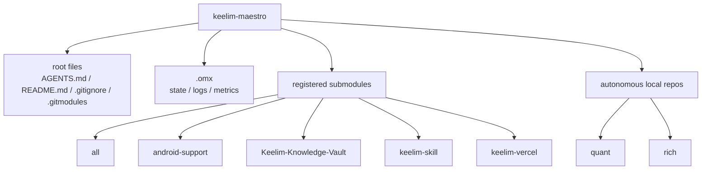

# keelim-maestro

This root repository is a **workspace superproject / coordination layer** for the child repositories in this folder.

## Workspace structure



## Current safe scope

This repository currently owns only root-level coordination files:

- `AGENTS.md`
- `README.md`
- `.gitignore`
- `.gitmodules`
- future root-only helper scripts/docs

The child repositories remain autonomous at the codebase level. Remote-backed repos can be tracked from the root via `.gitmodules`, while `quant` and `rich` remain outside the current submodule scope.

## Child repositories in this workspace

| Path | Remote? | Current status | Notes |
| --- | --- | --- | --- |
| `all` | yes | clean vs `origin/develop` | registered submodule |
| `android-support` | yes | clean vs `origin/main` | registered submodule |
| `Keelim-Knowledge-Vault` | yes | clean vs `origin/main` | registered submodule |
| `keelim-skill` | yes | clean vs `origin/main` | registered submodule |
| `keelim-vercel` | yes | clean vs `origin/develop` | registered submodule |
| `quant` | no | dirty local repo | intentionally excluded for now |
| `rich` | yes | ahead of `origin/master` by 30 | autonomous local repo; reconcile before future pinning |

## Why `/quant` is excluded

`/quant` has **no remote**, so it is intentionally excluded from the initial root superproject/submodule scope.

Do **not**:

- create a remote for `/quant` unless explicitly requested
- add `/quant` as a local-path submodule

Keeping `/quant` autonomous preserves safety and avoids a non-reproducible clone workflow.

## Why broader submodule conversion is deferred

Safe submodule conversion requires child repos to be pin-ready first. Right now that is blocked by:

- `quant` being a dirty local-only repo with no remote
- `rich` having local commits ahead of `origin/master`

Until those repos are normalized, do not expand root-level submodule coverage to them.

## Bootstrap / inspection commands

```bash
git status --short
git status --ignore-submodules=none
git submodule status
git submodule foreach git status --short --branch
git submodule update --init --recursive
```

Note: the submodule commands above are valid for the registered submodules in `.gitmodules`. `quant` remains intentionally excluded, and `rich` is still treated as an autonomous child repo from the root.

## Next safe steps before expanding submodule coverage

1. Reconcile or push the local commits currently ahead in `rich`.
2. Clean or explicitly preserve dirty local work in `quant` without discarding changes.
3. Expand `.gitmodules` only after any newly targeted remote-backed child repos are safe to pin.
4. Add new submodules from remote URLs only.
5. Verify with:
   - `git submodule status`
   - `git ls-files --stage | grep 160000`
   - `git status --ignore-submodules=none`

## Clone / future bootstrap flow

For the currently registered submodules, the reproducible bootstrap flow is:

```bash
git clone <root-repo>
cd keelim-maestro
git submodule update --init --recursive
```
