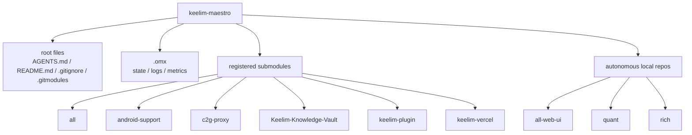

# keelim-maestro

This root repository is a **workspace superproject / coordination layer** for the child repositories in this folder.

## Workspace structure



## Current safe scope

This repository currently owns only root-level coordination files:

- `AGENTS.md`
- `README.md`
- `.gitignore`
- `package.json`
- `bun.lock`
- `.gitmodules`
- future root-only helper scripts/docs

The root may also carry a **Bun workspace bootstrap** for selected web repos. This is an orchestration layer for installs/scripts only; it does **not** collapse the child repositories into one Git monorepo.

## LiteLLM / Claude bridge location

The Claude Code + LiteLLM + Gemini bridge artifacts now live under `c2g-proxy/`, which is now a GitHub-backed root submodule and uv-managed bridge project with project-scoped `.env` onboarding.

Use:

- `c2g-proxy/README.md`
- `c2g-proxy/.env.example`
- `c2g-proxy/docs/claude-code-via-litellm-gemini.md`
- `c2g-proxy/docs/claude-code-via-litellm-gemini-verification.md`
- `c2g-proxy/scripts/litellm/`

Bridge onboarding now lives inside `c2g-proxy/`: copy `.env.example` to `.env`,
run `uv sync`, then use the bundled start/verify helpers.

The child repositories remain autonomous at the codebase level. Remote-backed repos can be tracked from the root via `.gitmodules`; `c2g-proxy` is now pinned there as the bridge repo, while `quant` and `rich` remain outside the current submodule scope.
`all-web-ui` now has a public remote repository, but it is still managed as an autonomous child repo from the root until the remaining workspace blockers are resolved.

## Bun workspace bootstrap

The current web workspace bootstrap is intentionally narrow and matches the root `package.json` workspaces:

- `all-web-ui`
- `keelim-vercel`
- `rich/open-trading-api/strategy_builder/frontend`
- `rich/open-trading-api/backtester/frontend`
- `rich/web`
- `toto`

Goals:

- allow root-level `bun install` and filtered web verification commands
- keep each child repo independently cloneable and deployable
- keep Vercel pointed at app-specific root directories instead of treating the root as one merged app

Non-goals:

- merging Git history
- replacing child-repo ownership with root ownership
- forcing `workspace:*` references where standalone repos still need independent installs

### Frontend dependency contract

For local multi-repo frontend work, the root Bun workspace is the authoritative
install and verification surface for:

- `all-web-ui`
- `keelim-vercel`
- `rich/web`
- `rich/open-trading-api/strategy_builder/frontend`
- `rich/open-trading-api/backtester/frontend`

`toto` remains a root workspace member for the current root scripts, but it is
not part of the shared frontend dependency migration lane. The two nested
`rich/open-trading-api/*/frontend` workspaces are registered for local sidecar
bootstrap and verification only; they do not make `rich` safe to pin while its
child repo is dirty/ahead. The `all-web-ui` consumer protocol is intentionally explicit: consumers may retain sibling
`file:` references while standalone app-root installs and Vercel-style builds
depend on that shape. A future `workspace:*` switch is acceptable only after
root frozen install, root filtered checks, and each consumer's app-root
install/build path pass under the same deployment shape used by Vercel.

When consumers retain `file:`, root `bun.lock` may still contain legitimate
workspace package registrations such as `all-web-ui@workspace:all-web-ui`.
The invalid state is drift inside consumer dependency specs or consumer
dependency entries, not the existence of root workspace registrations.

Package-local `bun.lock` files remain the standalone child-repo fallback unless
a later documented change explicitly retires child-local installs. In the
current topology, deleting package-local `node_modules` is not the meaningful
storage win: `rich/web/node_modules` is symlink-sized and the real shared store
lives at root `node_modules`.

### Bun workspace prerequisites

The root workspace assumes these directories already exist locally:

- `all-web-ui/`
- `keelim-vercel/`
- `rich/web/`
- `rich/open-trading-api/strategy_builder/frontend/`
- `rich/open-trading-api/backtester/frontend/`
- `toto/`

`keelim-vercel` is available from the root submodule bootstrap, but `all-web-ui` and `rich` are still autonomous child repos, **not** root submodules. The nested Open Trading frontend workspaces are expected under the hydrated `rich/` checkout. `toto` is also a root workspace member; if it is absent locally, root-level Bun workspace commands that target `toto` will fail until it is hydrated. That means a fresh root clone must hydrate the autonomous repos separately **before** running root `bun install`.

Example hydration flow:

```bash
git clone <root-repo>
cd keelim-maestro
git submodule update --init --recursive

# hydrate autonomous web repos expected by the Bun workspace
git clone https://github.com/keelim/all-web-ui.git all-web-ui
git clone https://github.com/keelim/rich.git rich

bun install
```

If those autonomous repos are absent, Bun workspace installation will fail because the workspace paths are intentionally fixed to the local workspace layout.

## Knowledge system docs

The first-pass knowledge-system documentation lives under `docs/knowledge/`:

- `docs/knowledge/README.md` — workspace contract and scope
- `docs/knowledge/operator-runbook.md` — bootstrap, validation, Neo4j, and MCP flow
- `docs/knowledge/source-targets.md` — grounded analyzer targets for `all`, `rich`, and `keelim-vercel`
- `docs/knowledge/review-checklist.md` — review and handoff checklist
- `docs/knowledge/merge-guidance.md` — cross-lane integration and conflict-resolution guidance
- `docs/knowledge/verification-contract.md` — expected verification evidence and PASS/FAIL conventions

## Child repositories in this workspace

| Path | Remote? | Current status | Notes |
| --- | --- | --- | --- |
| `all` | yes | clean vs `origin/develop` | registered submodule |
| `all-web-ui` | yes | clean vs `origin/main` | autonomous shared UI repo with public remote; included in root subrepo helper + integration verification |
| `android-support` | yes | detached HEAD, clean | registered submodule |
| `c2g-proxy` | yes | clean vs `origin/main` | registered submodule for the Claude Code + LiteLLM + Gemini bridge |
| `Keelim-Knowledge-Vault` | yes | ahead of `origin/main` by 7 | registered submodule; do not pin until owner reconciles |
| `keelim-plugin` | yes | detached HEAD, clean | registered submodule |
| `keelim-vercel` | yes | clean vs `origin/develop` | registered submodule and Vercel-linked app |
| `toto` | yes | ahead of `origin/main` by 3 | registered submodule and local KBO dashboard workspace member; do not pin until owner reconciles |
| `quant` | no | absent in this checkout | intentionally excluded for now |
| `rich` | yes | ahead of `origin/master` by 12 with mixed dirty state | autonomous local repo; freeze/split before future pinning or data modernization |


## Why `/quant` is excluded

`/quant` has **no remote**, so it is intentionally excluded from the initial root superproject/submodule scope.

Do **not**:

- create a remote for `/quant` unless explicitly requested
- add `/quant` as a local-path submodule

Keeping `/quant` autonomous preserves safety and avoids a non-reproducible clone workflow.

## Why broader submodule conversion is deferred

Broader child-repo submodule conversion still requires pin-ready repos first. The explicit exception is `c2g-proxy`, which was added directly from its GitHub remote because it is already remote-backed and pin-ready. Further expansion is still blocked by:

- `quant` having no remote-backed reproducible path and remaining intentionally excluded
- any other child repos that are dirty or temporarily diverged from the pinned root state

Until those repos are normalized, do not expand root-level submodule coverage to them.

## Bootstrap / inspection commands

```bash
git status --short
git status --ignore-submodules=none
git submodule status
git submodule foreach git status --short --branch
git submodule update --init --recursive
```

Note: the submodule commands above are valid for the registered submodules in `.gitmodules`. `quant` remains intentionally excluded, and `rich` is still treated as an autonomous child repo from the root.
`all-web-ui` is also surfaced through the root helper scripts as an autonomous child repo, but it is not yet a registered submodule.

## Subrepo update helper

Tracked submodule default branches are declared in `.gitmodules`:

- `all` -> `develop`
- `android-support` -> `main`
- `c2g-proxy` -> `main`
- `Keelim-Knowledge-Vault` -> `main`
- `keelim-plugin` -> `main`
- `keelim-vercel` -> `main`
- `toto` -> `main`

Helper script:

```bash
./scripts/update-subrepos.sh status
./scripts/update-subrepos.sh update
./scripts/update-subrepos.sh update --dry-run
./scripts/update-subrepos.sh dry-run
```

Behavior:

- reads tracked submodule paths from `.gitmodules`
- includes autonomous local repos `all-web-ui`, `rich`, and `quant` in status output
- updates only clean repos on `main` / `master` / `develop`
- supports dry-run preview before any fetch / pull
- skips repos with local commits ahead of upstream
- uses `git pull --ff-only` for safer updates

## Next safe steps before expanding submodule coverage

1. Freeze/split the mixed dirty state in `rich` before any future pinning or data modernization.
2. Reconcile child repos that are ahead of their upstreams, currently including `Keelim-Knowledge-Vault` and `toto`.
3. Keep `quant` excluded unless a future explicit request provides a reproducible remote-backed path.
4. Expand `.gitmodules` only after any newly targeted remote-backed child repos are safe to pin.
5. Add new submodules from remote URLs only.
6. Verify with:
   - `git submodule status`
   - `git ls-files --stage | grep 160000`
   - `git status --ignore-submodules=none`

## Clone / future bootstrap flow

For the currently registered submodules, the reproducible bootstrap flow is:

```bash
git clone <root-repo>
cd keelim-maestro
git submodule update --init --recursive
```

If you also want the root Bun workspace bootstrap, hydrate the autonomous repos expected by that workspace (`all-web-ui`, `rich`, including nested `rich/open-trading-api/*/frontend` paths) before running root `bun install`; see **Bun workspace prerequisites** above.
