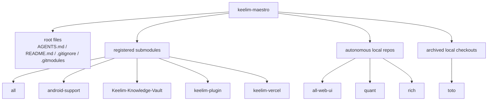
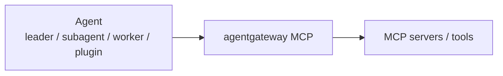

# keelim-maestro

This root repository is a **workspace superproject / coordination layer** for the child repositories in this folder.

## Workspace structure


```mermaid
flowchart TB
    root["keelim-maestro"]

    root --> rootFiles["root files<br/>AGENTS.md / README.md / .gitignore / .gitmodules"]
    root --> submodules["registered submodules"]
    root --> localRepos["autonomous local repos"]
    root --> archivedRepos["archived local checkouts"]

    submodules --> all["all"]
    submodules --> android["android-support"]
    submodules --> vault["Keelim-Knowledge-Vault"]
    submodules --> skill["keelim-plugin"]
    submodules --> vercel["keelim-vercel"]

    localRepos --> allWebUi["all-web-ui"]
    localRepos --> quant["quant"]
    localRepos --> rich["rich"]
    archivedRepos --> toto["toto"]
```

## MCP routing model

All MCP calls are modeled as passing through `agentgateway` regardless of the
agent type. Agent type changes the execution role, not the MCP ingress path.


```mermaid
flowchart LR
    agent["Agent<br/>leader / subagent / worker / plugin"] --> gateway["agentgateway MCP"]
    gateway --> mcp["MCP servers / tools"]
```

When adding or describing an MCP integration, document it behind
`agentgateway` unless a lower-level implementation detail explicitly needs to
be called out.

Codex and Claude Code should use the shared `agentgateway` MCP endpoint at
`http://localhost:3000/mcp` for MCP tools.

## Current safe scope

This repository currently owns only root-level coordination files:

- `AGENTS.md`
- `README.md`
- `.gitignore`
- `package.json`
- `bun.lock`
- `.gitmodules`
- `docs/ops/`
- `docs/idea/`
- future root-only helper scripts/docs

The root may also carry a **Bun workspace bootstrap** for selected web repos. This is an orchestration layer for installs/scripts only; it does **not** collapse the child repositories into one Git monorepo.

The child repositories remain autonomous at the codebase level. Remote-backed repos can be tracked from the root via `.gitmodules`; `quant`, `rich`, and archived `toto` remain outside the current active submodule scope.
`all-web-ui` now has a public remote repository, but it is still managed as an autonomous child repo from the root until the remaining workspace blockers are resolved.
`toto` is archived from root coordination as of 2026-06-04. A local `toto/`
checkout may remain for historical context, but it is ignored by the root and is
not an active submodule, workspace member, helper-script target, or idea backlog
target.

Root idea/backlog maintenance now lives under `docs/idea/`, with `docs/idea/index.md` as the workspace index and `docs/idea/<project>.md` as each project's idea file. A root-level `idea/` directory should not be recreated.

## Trusted baseline report

Use the read-only trusted-baseline reporter before root-level pinning,
submodule, or workspace-boundary work:

```bash
bun run report:baseline
```

The report is a live observation assembled from `.gitmodules`, active gitlinks,
root workspace manifests, root policy, and child Git status. It does not mutate
child repositories and is not permission to pin or repair child state.

## Shared UI contract report

Use the read-only shared UI contract reporter when touching `all-web-ui` or one
of its current web consumers:

```bash
bun run report:shared-ui
```

The report ties together the provider package identity, package exports,
style/theme entrypoints, downstream dependency/import signals, the static
integration verifier, build-canary command inventory, and visual-regression
readiness. It observes the `all-web-ui` provider plus the `keelim-vercel` and
`rich/web` consumers without mutating child repositories. Use
`scripts/verify-all-web-ui-integration.sh` for strict static failure semantics.

## Local automation stack

Use `docs/ops/local-automation-stack.md` for the root-owned audit of local
automation runtimes: `rich` local Kubernetes, `youtube` n8n Kubernetes, and
`tools/agentgateway`. The root owns the cross-runtime contract, while each
runtime keeps its own manifests, scripts, secrets, and verification commands.

Use the root helper only as a script index / delegator:

```bash
bun run automation:local -- list
bun run automation:local -- status
bun run automation:local -- standby
bun run automation:local -- verify rich
bun run automation:local -- start agentgateway
bun run automation:local -- stop n8n
```

`agentgateway` is the fixed local Kubernetes resource for MCP access. `rich` and
`n8n` are on-demand runtimes: start them only while using their features, then
run `bun run automation:local -- standby` to stop the Rich Skaffold loop if it is
active and scale Rich/n8n deployments to zero without deleting namespaces, PVCs,
Secrets, or manifests. `status` and `list` are read-only. `start` and `stop`
require an explicit runtime target and delegate to the owning runtime's
documented command.

## CodeGraph dispatcher

Use the root CodeGraph dispatcher when you want root-level orchestration over
child repo graphs without creating an aggregate root `.codegraph/`:

```bash
bun run cg -- list
bun run cg:status
bun run cg -- files rich --max-depth 2
bun run cg -- context keelim-plugin "skill inventory"
bun run cg:root-check
```

The dispatcher routes CodeGraph commands to the child repo selected with
`--path`. It never initializes `.codegraph/` and does not use root as a child
target. If a child graph is missing, initialize that child explicitly with the
CodeGraph CLI after confirming the repo boundary and ignore coverage.

## Bun workspace bootstrap

The current Bun workspace bootstrap is intentionally narrow. Its workspace
members are the paths declared in the root `package.json`:

- `all-web-ui`
- `keelim-vercel`
- `rich/web`

The nested Open Trading frontend paths under `rich/open-trading-api/*/frontend`
are not root Bun workspace members unless `package.json` later declares them.
They remain child-repo helper/dev paths reached through root convenience scripts.

Goals:

- allow root-level `bun install` and filtered web verification commands
- keep each child repo independently cloneable and deployable
- keep Vercel pointed at app-specific root directories instead of treating the root as one merged app

Non-goals:

- merging Git history
- replacing child-repo ownership with root ownership
- forcing `workspace:*` references where standalone repos still need independent installs

### Frontend dependency contract

For local multi-repo frontend work, the root Bun workspace is the authoritative
install and verification surface for these frontend workspace members:

- `all-web-ui`
- `keelim-vercel`
- `rich/web`

The two nested `rich/open-trading-api/*/frontend` paths are local sidecar
helper/dev surfaces inside the autonomous `rich` child repo; they do not become
root workspace members or make `rich` safe to pin while its child repo is dirty.
`rich/web` intentionally uses the root Bun workspace as its install/verification
surface so its `catalog:` dependencies resolve from the root catalog.
Standalone consumers outside that root workspace install the exact GitHub
Packages dependency `@keelim/all-web-ui@0.1.4` through
`https://npm.pkg.github.com`.

Root `bun.lock` may therefore contain legitimate workspace package registrations
for `@keelim/all-web-ui` when the local package version matches the exact
consumer version. The invalid state is drift inside consumer dependency specs,
unscoped `all-web-ui` imports, or missing GitHub Packages registry mapping.
The full integration verifier also checks that `@keelim/all-web-ui@0.1.4` is
visible from `https://npm.pkg.github.com`; a passing build-only run is not enough
to prove the package was published. That registry check uses `NODE_AUTH_TOKEN`
or the local GitHub CLI token when GitHub Packages requires authenticated reads.

Package-local `bun.lock` files remain standalone fallback artifacts for
standalone consumers such as `keelim-vercel`.
`rich/web` is the exception in this shared frontend lane: use root `bun.lock`
and root workspace commands for its dependency resolution. In the current
topology, deleting package-local `node_modules` is not the meaningful storage
win: `rich/web/node_modules` is symlink-sized and the real shared store lives at
root `node_modules`.

Each standalone consumer that installs `@keelim/all-web-ui` needs an `.npmrc`
scope mapping for `@keelim` and a `NODE_AUTH_TOKEN`/GitHub token with package
read access in local, CI, or Vercel build environments.

### Bun workspace prerequisites

The root Bun workspace assumes these package workspace directories already
exist locally:

- `all-web-ui/`
- `keelim-vercel/`
- `rich/web/`

`keelim-vercel` is available from the root submodule bootstrap, but
`all-web-ui` and `rich` are still autonomous child repos, **not** root
submodules. That means a fresh root clone must hydrate the autonomous repos
that contain package workspace paths separately **before** running root
`bun install`. Archived `toto/` is not required for root Bun installation.

The root also exposes helper dev scripts for these non-workspace child paths
inside the hydrated `rich/` checkout:

- `rich/open-trading-api/strategy_builder/`
- `rich/open-trading-api/backtester/`

Example hydration flow:

```bash
git clone <root-repo>
cd keelim-maestro
git submodule update --init --recursive

# hydrate autonomous repos expected by the Bun workspace
git clone https://github.com/keelim/all-web-ui.git all-web-ui
git clone https://github.com/keelim/rich.git rich

bun install
```

If those autonomous repos are absent, Bun workspace installation will fail
because the package workspace paths are intentionally fixed to the local
workspace layout. The nested Open Trading helper paths require the same hydrated
`rich/` checkout, but they are not root Bun workspace members.

## Python uv workspace bootstrap

The root also carries a narrow uv workspace for Python dependency coordination across the in-scope Python projects:

- `rich`

This uv workspace is separate from the Bun workspace bootstrap. It does not change `package.json`, `bun.lock`, frontend install behavior, or child-repo Git ownership.

The root uv project is coordination-only (`tool.uv.package = false`) and uses `requires-python = ">=3.13"` because `rich` requires Python 3.13 or newer. Archived `toto` is no longer part of root uv operations.

Shared Python packages should use aligned constraints across uv workspace members. The root uv workspace enforces shared dependency policy with `tool.uv.constraint-dependencies` for the active Python member set.

Child repos keep matching declarations for directly used shared packages as standalone fallback, and the root verification script fails if those mirrors drift.

Useful root-level uv checks:

```bash
uv run python scripts/verify-python-dependency-constraints.py
uv workspace metadata
uv lock --check
uv run --package keelim-rich --group dev pytest rich/tests
```

Sandboxed agent sessions can pass `--cache-dir .omx/uv-cache` if the default uv cache is not writable.

Package-local lockfiles remain standalone child-repo fallback artifacts unless a later documented change explicitly retires them.

## Knowledge system docs

The first-pass knowledge-system documentation lives under `docs/knowledge/`:

- `docs/knowledge/README.md` — workspace contract and scope
- `docs/knowledge/operator-runbook.md` — bootstrap, validation, Neo4j, and MCP flow
- `docs/knowledge/source-targets.md` — grounded analyzer targets for `all`, `rich`, and `keelim-vercel`
- `docs/knowledge/review-checklist.md` — review and handoff checklist
- `docs/knowledge/merge-guidance.md` — cross-lane integration and conflict-resolution guidance
- `docs/knowledge/verification-contract.md` — expected verification evidence and PASS/FAIL conventions

## Child repositories in this workspace

| Path | Remote? | Current status | Notes |
| --- | --- | --- | --- |
| `all` | yes | clean vs `origin/develop` | registered submodule |
| `all-web-ui` | yes | clean vs `origin/main` | autonomous shared UI repo with public remote and GitHub Packages npm publishing; included in root subrepo helper + integration verification |
| `android-support` | yes | detached clean at pinned commit `485a2e40`; no local upstream | registered submodule |
| `Keelim-Knowledge-Vault` | yes | clean vs `origin/main` | registered submodule |
| `keelim-plugin` | yes | clean vs `origin/main` | registered submodule |
| `keelim-vercel` | yes | clean vs `origin/develop` | registered submodule and Vercel-linked app |
| `quant` | no | absent in this checkout | intentionally excluded for now |
| `rich` | yes | dirty working tree, no ahead/behind drift vs `origin/master` | autonomous local repo; freeze/split before future pinning or data modernization |

## Archived child checkouts

| Path | Status | Root treatment |
| --- | --- | --- |
| `toto` | archived as of 2026-06-04 | ignored local historical checkout; not a registered submodule, Bun workspace member, uv workspace member, CodeGraph target, codemap refresh target, or active idea backlog target |

## Why `/quant` is excluded

`/quant` has **no remote**, so it is intentionally excluded from the initial root superproject/submodule scope.

Do **not**:

- create a remote for `/quant` unless explicitly requested
- add `/quant` as a local-path submodule

Keeping `/quant` autonomous preserves safety and avoids a non-reproducible clone workflow.

## Why broader submodule conversion is deferred

Broader child-repo submodule conversion still requires pin-ready repos first. Further expansion is still blocked by:

- `quant` having no remote-backed reproducible path and remaining intentionally excluded
- any other child repos that are dirty or temporarily diverged from the pinned root state

Until those repos are normalized, do not expand root-level submodule coverage to them.

## Bootstrap / inspection commands

```bash
git status --short
git status --ignore-submodules=none
git submodule status
git submodule foreach git status --short --branch
git submodule update --init --recursive
```

Note: the submodule commands above are valid for the registered submodules in `.gitmodules`. `quant` remains intentionally excluded, and `rich` is still treated as an autonomous child repo from the root.
`all-web-ui` is also surfaced through the root helper scripts as an autonomous child repo, but it is not yet a registered submodule.

## Root test command

The root `test` script is intentionally lightweight and should remain safe to run at any time:

```bash
bun run test
```

It verifies the root superproject contract: package metadata, required helper scripts, and autonomous-repo boundaries. It does not run heavy child-repo builds or dirty working-tree-sensitive app suites. Use the narrower scripts below when you intentionally want those surfaces:

```bash
bun run typecheck:web
bun run build:web
bun run test:web
bun run dev:codex-app-server
./scripts/verify-all-web-ui-integration.sh --full
```

## Codex app-server helper

Use the root helper when you want a local Codex app-server bound to this
workspace:

```bash
bun run dev:codex-app-server
codex --remote ws://127.0.0.1:7331
```

The helper defaults to local-only WebSocket transport at
`ws://127.0.0.1:7331`. Override `CODEX_APP_SERVER_LISTEN` for other supported
transports such as `unix:///tmp/codex-app.sock`, and pass additional
`codex app-server` options after the script command when needed.

## Subrepo update helper

Tracked submodule default branches are declared in `.gitmodules`:

- `all` -> `develop`
- `android-support` -> `main`
- `Keelim-Knowledge-Vault` -> `main`
- `keelim-plugin` -> `main`
- `keelim-vercel` -> `develop`

Helper script:

```bash
./scripts/update-subrepos.sh status
./scripts/update-subrepos.sh update
./scripts/update-subrepos.sh update --dry-run
./scripts/update-subrepos.sh dry-run
```

Behavior:

- reads tracked submodule paths from `.gitmodules`
- includes autonomous local repos `all-web-ui`, `rich`, and `quant` when present in status output
- updates only clean repos on `main` / `master` / `develop`
- supports dry-run preview before any fetch / pull
- skips repos with local commits ahead of upstream
- uses `git pull --ff-only` for safer updates

## Next safe steps before expanding submodule coverage

1. Freeze/split the mixed dirty state in `rich` before any future pinning or data modernization.
2. Re-run `bun run report:baseline` before any expansion and reconcile any future ahead/behind child repos it reports.
3. Keep `quant` excluded unless a future explicit request provides a reproducible remote-backed path.
4. Expand `.gitmodules` only after any newly targeted remote-backed child repos are safe to pin.
5. Add new submodules from remote URLs only.
6. Verify with:
   - `git submodule status`
   - `git ls-files --stage | grep 160000`
   - `git status --ignore-submodules=none`

## Clone / future bootstrap flow

For the currently registered submodules, the reproducible bootstrap flow is:

```bash
git clone <root-repo>
cd keelim-maestro
git submodule update --init --recursive
```

If you also want the root Bun workspace bootstrap, hydrate the autonomous repos
that contain package workspace paths (`all-web-ui`, `rich`) before running root
`bun install`; see **Bun workspace prerequisites** above. The nested
`rich/open-trading-api/*` paths are helper/dev paths inside the hydrated `rich`
checkout, not root Bun workspace members.
