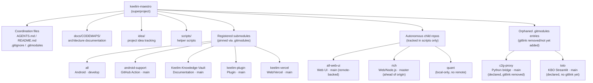

# Workspace Architecture

## Overview

`keelim-maestro` is a **federated multi-repository workspace** (Git superproject).
Each child directory is its own autonomous Git repository with its own history,
branch model, and build toolchain. The root repository's sole responsibility is
workspace-level coordination: submodule pointers, documentation, and helper scripts.

## Topology



## Child Repository Catalogue

| Path | Remote | Default branch | Type | Registration |
|------|--------|----------------|------|--------------|
| `all` | https://github.com/keelim/all | `develop` | Android (Gradle multi-module) | Registered submodule |
| `all-web-ui` | https://github.com/keelim/all-web-ui | `main` | Shared web UI | Autonomous (pending submodule) |
| `android-support` | https://github.com/keelim/android-support | `main` | TypeScript / Node.js GitHub Action | Registered submodule |
| `c2g-proxy` | https://github.com/keelim/c2g-proxy | `main` | Python / LiteLLM bridge | **Orphaned** — in `.gitmodules` but gitlink removed from index; no directory |
| `Keelim-Knowledge-Vault` | https://github.com/keelim/Keelim-Knowledge-Vault | `main` | Documentation | Registered submodule |
| `keelim-plugin` | https://github.com/keelim/keelim-plugin | `main` | Plugin project | Registered submodule |
| `keelim-vercel` | https://github.com/keelim/keelim-vercel | `main` | Web / Vercel deployment | Registered submodule |
| `quant` | none | n/a | local-only (no remote) | Intentionally excluded |
| `rich` | https://github.com/keelim/rich | `master` | Web / Node.js | Autonomous (pending reconciliation) |
| `toto` | https://github.com/keelim/toto | `main` | Streamlit / Python (KBO dashboard) | **Declared in `.gitmodules`; no gitlink yet; directory absent** |

## Architectural Principles

### 1. Child-repository autonomy
Each child directory is its own Git context. When modifying code inside a child
repo, enter that directory and follow its own `AGENTS.md` if present. Root-level
commits must not edit child-repo source files.

### 2. Remote-backed submodules only
Submodules are added via their GitHub remote URL only. Local-path submodules are
prohibited because they break reproducible clone workflows.

### 3. Smallest reversible root diff
Root changes should prefer updating documentation, `.gitmodules` pointers, or
helper scripts rather than automating child-repo operations. Automation is
introduced only after child repos are in a clean, pinnable state.

### 4. Submodule expansion gate
Expanding `.gitmodules` to cover additional child repos is blocked until:
- All existing child repos are clean (no dirty working trees)
- `rich` local commits ahead of origin are reconciled / pushed
- `quant` dirty state is explicitly resolved or preserved
- Any other diverged repos are normalised

## Bootstrap

```bash
git clone https://github.com/keelim/keelim-maestro.git
cd keelim-maestro
git submodule update --init --recursive
```

## Verification Commands

```bash
# Root status (ignores submodule internals)
git status --short

# Root status (includes submodule dirty/new states)
git status --ignore-submodules=none

# Submodule commit pointers
git submodule status

# Branch / dirty state inside each submodule
git submodule foreach git status --short --branch

# Confirm submodule gitlinks
git ls-files --stage | grep 160000
```

## Safe Scope for Root Commits

Files that are safe to modify at the root level:

- `AGENTS.md`
- `README.md`
- `.gitignore`
- `.gitmodules`
- `docs/` (including this directory)
- `idea/`
- `scripts/`

Files and directories that must **not** be edited from the root:
- Any source file inside a child-repo directory (`all/`, `android-support/`, etc.)

## Current Submodule Snapshot

> Last updated: 2026-04-28

| Path | Pinned commit | Branch | Status |
|------|---------------|--------|--------|
| `all` | `778491a6c` | `develop` | Not initialized (empty dir) |
| `android-support` | `485a2e40` | `main` | Not initialized (empty dir) |
| `Keelim-Knowledge-Vault` | `d82b20d3` | `main` | Not initialized (empty dir) |
| `keelim-plugin` | `156059ac` | `main` | Not initialized (empty dir) |
| `keelim-vercel` | `e91f0eec` | `main` | Not initialized (empty dir) |
| `c2g-proxy` | — | `main` | **Orphaned**: declared in `.gitmodules`; gitlink removed from index; directory absent |
| `toto` | — | `main` | **Pending**: declared in `.gitmodules`; no gitlink committed; directory absent |
| `all-web-ui` | — | `main` | Autonomous (not in .gitmodules) |
| `rich` | — | `master` | Autonomous, commits ahead of origin |
| `quant` | — | — | Local-only (no remote) |
