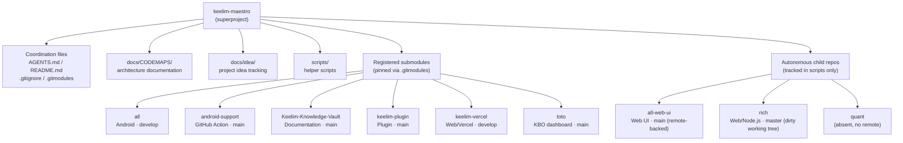

# Workspace Architecture

## Overview

`keelim-maestro` is a **federated multi-repository workspace** (Git superproject).
Each child directory is its own autonomous Git repository with its own history,
branch model, and build toolchain. The root repository's sole responsibility is
workspace-level coordination: submodule pointers, documentation, and helper scripts.

The root carries two workspace bootstrap layers that operate independently:
- **Bun workspace** (`package.json`) — JavaScript/TypeScript projects: `all-web-ui`, `keelim-vercel`, `rich/web`, `toto`.
- **uv workspace** (`pyproject.toml`) — Python projects: `toto`, `rich`.

## Topology


```mermaid
flowchart TB
    root["keelim-maestro\n(superproject)"]

    root --> coord["Coordination files\nAGENTS.md / README.md\n.gitignore / .gitmodules"]
    root --> docs["docs/CODEMAPS/\narchitecture documentation"]
    root --> idea["docs/idea/\nproject idea tracking"]
    root --> scripts["scripts/\nhelper scripts"]
    root --> submodules["Registered submodules\n(pinned via .gitmodules)"]
    root --> autonomous["Autonomous child repos\n(tracked in scripts only)"]

    submodules --> all["all\nAndroid · develop"]
    submodules --> android["android-support\nGitHub Action · main"]
    submodules --> vault["Keelim-Knowledge-Vault\nDocumentation · main"]
    submodules --> plugin["keelim-plugin\nPlugin · main"]
    submodules --> vercel["keelim-vercel\nWeb/Vercel · develop"]
    submodules --> toto["toto\nKBO dashboard · main"]

    autonomous --> webui["all-web-ui\nWeb UI · main (remote-backed)"]
    autonomous --> rich["rich\nWeb/Node.js · master (dirty working tree)"]
    autonomous --> quant["quant\n(absent, no remote)"]
```

## Child Repository Catalogue

| Path | Remote | Default branch | Type | Registration |
|------|--------|----------------|------|-------------- |
| `all` | https://github.com/keelim/all | `develop` | Android (Gradle multi-module) | Registered submodule |
| `all-web-ui` | https://github.com/keelim/all-web-ui | `main` | Shared web UI | Autonomous (pending submodule) |
| `android-support` | https://github.com/keelim/android-support | `main` | TypeScript / Node.js GitHub Action | Registered submodule |
| `Keelim-Knowledge-Vault` | https://github.com/keelim/Keelim-Knowledge-Vault | `main` | Documentation | Registered submodule |
| `keelim-plugin` | https://github.com/keelim/keelim-plugin | `main` | Plugin project | Registered submodule |
| `keelim-vercel` | https://github.com/keelim/keelim-vercel | `develop` | Web / Vercel deployment | Registered submodule |
| `toto` | https://github.com/keelim/toto | `main` | Local KBO Streamlit dashboard | Registered submodule |
| `quant` | none | n/a | absent in this checkout; local-only when present | Intentionally excluded |
| `rich` | https://github.com/keelim/rich | `master` | Web / Node.js | Autonomous (pending reconciliation) |

## Architectural Principles

### 1. Child-repository autonomy
Each child directory is its own Git context. When modifying code inside a child
repo, enter that directory and follow its own `AGENTS.md` if present. Root-level
commits must not edit child-repo source files.

### 2. Remote-backed submodules only
Submodules are added via their GitHub remote URL only. Local-path submodules are
prohibited because they break reproducible clone workflows.

### 3. Smallest reversible root diff
Root changes should prefer updating documentation, `.gitmodules` pointers, or
helper scripts rather than automating child-repo operations. Automation is
introduced only after child repos are in a clean, pinnable state.

### 4. Submodule expansion gate
Expanding `.gitmodules` to cover additional child repos is blocked until:
- All existing child repos are clean (no dirty working trees)
- `rich` dirty working tree is reconciled or explicitly preserved
- `quant` absence/no-remote state is explicitly preserved
- Any other diverged repos are normalised

## Bootstrap

```bash
git clone https://github.com/keelim/keelim-maestro.git
cd keelim-maestro
git submodule update --init --recursive
```

## Verification Commands

```bash
# Root status (ignores submodule internals)
git status --short

# Root status (includes submodule dirty/new states)
git status --ignore-submodules=none

# Submodule commit pointers
git submodule status

# Branch / dirty state inside each submodule
git submodule foreach git status --short --branch

# Confirm submodule gitlinks
git ls-files --stage | grep 160000
```

## Trusted Baseline Scoreboard

For live root-maintenance evidence, run:

```bash
sh scripts/report-trusted-baseline.sh
```

or:

```bash
bun run report:baseline
```

The scoreboard reports child repo registration, branch, dirty state, upstream
divergence, remote presence, active gitlink evidence, Bun workspace membership,
uv workspace membership, eligibility, and blocker reasons.

This report is a current observation surface. It does not replace
`.gitmodules`, active `160000` gitlinks, `package.json`, `pyproject.toml`, or
the root policy docs, and it is not permission to pin, repair, or mutate child
repositories.

## Shared UI Contract Control Tower

For live shared-frontend evidence, run:

```bash
sh scripts/report-shared-ui-contract.sh
```

or:

```bash
bun run report:shared-ui
```

The report observes `@keelim/all-web-ui@0.1.4` and the current downstream
consumers `keelim-vercel` and `rich/web`. It combines
provider export/style metadata, exact dependency specs, GitHub Packages
registry mapping, scoped import signals, the existing static integration
verifier, build-canary command inventory, and visual-regression readiness.

This control tower is root-owned and read-only. It is not permission to edit
consumer source, publish a package, update lockfiles, or convert
`all-web-ui` into a root submodule.

## Safe Scope for Root Commits

Files that are safe to modify at the root level:

- `AGENTS.md`
- `README.md`
- `.gitignore`
- `.gitmodules`
- `docs/` (including this directory and `docs/idea/`)
- `scripts/`

Files and directories that must **not** be edited from the root:
- Any source file inside a child-repo directory (`all/`, `android-support/`, etc.)

## Current Submodule Snapshot

> Last updated: 2026-06-05

| Path | Pinned commit | Branch | Status |
|------|---------------|--------|----------|
| `all` | `0643bab4` | `develop` | Registered submodule |
| `android-support` | `485a2e40` | `main` | Registered submodule |
| `Keelim-Knowledge-Vault` | `15b29c11` | `main` | Registered submodule |
| `keelim-plugin` | `a3463396` | `main` | Registered submodule |
| `keelim-vercel` | `1304f121` | `develop` | Registered submodule |
| `toto` | `5897ef44` | `main` | Registered submodule |
| `all-web-ui` | — | `main` | Autonomous (not in .gitmodules) |
| `rich` | — | `master` | Autonomous, dirty working tree |
| `quant` | — | — | Absent in this checkout; no remote |
